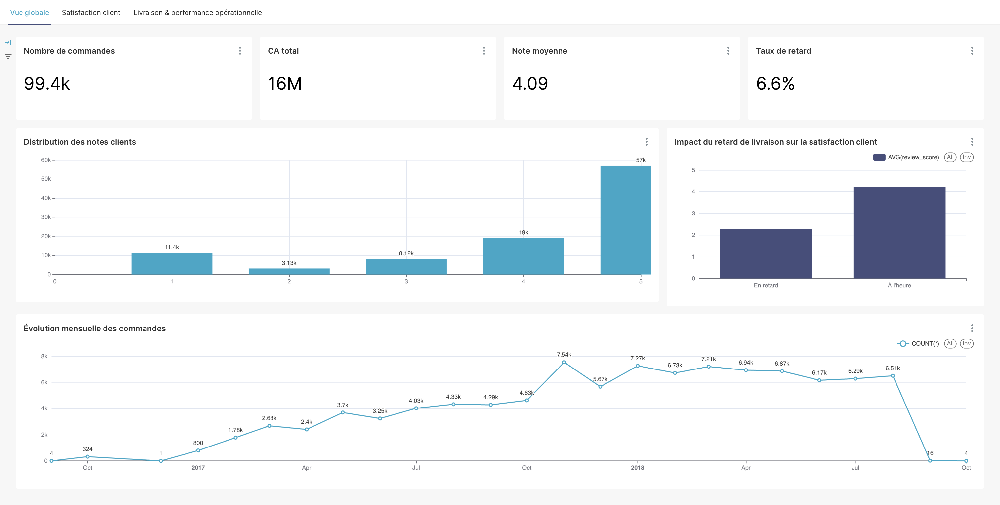
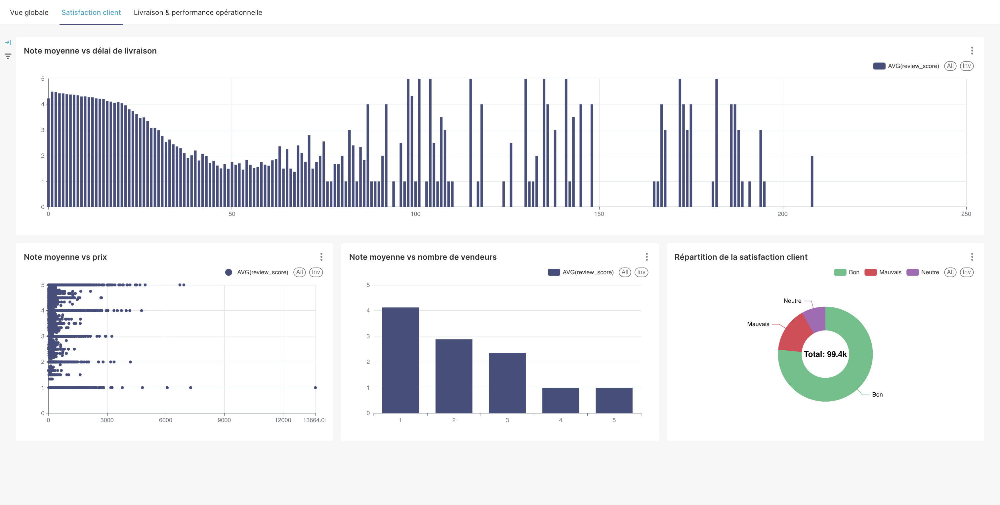
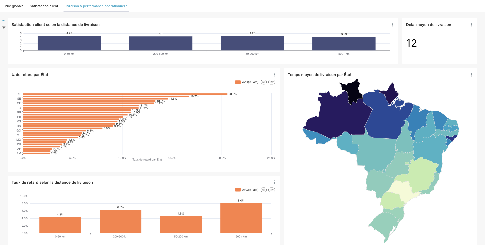

# Olist E-commerce Analysis

Analyse de données du marché brésilien Olist — pipeline ETL complet avec entrepôt de données PostgreSQL, modélisation statistique et dashboards interactifs Apache Superset.

## Aperçu du dashboard

<!-- Remplace les chemins ci-dessous par tes captures d'écran Superset (ex: docs/img/dashboard_1.png) -->





---

## Contexte

Le dataset [Olist](https://www.kaggle.com/datasets/olistbr/brazilian-ecommerce) contient ~100 000 commandes passées sur le marketplace brésilien entre 2016 et 2018. Ce projet cherche à comprendre les **facteurs qui influencent la satisfaction client** (score d'avis) à travers :

- les délais de livraison
- les retards par rapport à la date estimée
- la distance géographique entre client et vendeur
- le montant et la composition de la commande

---

## Architecture du projet

Le projet repose sur une architecture BI simple et reproductible, permettant de transformer des fichiers CSV bruts en tables analytiques exploitables dans Apache Superset.

```text
data/raw/*.csv
    │
    │  load_raw_data.py
    │  → import des fichiers CSV
    │  → normalisation des noms de colonnes
    │  → création du schéma raw
    ▼
PostgreSQL — schéma "raw"
    │
    │  9 tables sources :
    │  • customers
    │  • geolocation
    │  • order_items
    │  • order_payments
    │  • order_reviews
    │  • orders
    │  • products
    │  • sellers
    │  • product_category_translation
    │
    │  build_order_features.py
    │  → jointures entre commandes, clients, paiements, avis, vendeurs et géolocalisation
    │  → calcul des indicateurs de livraison
    │  → calcul de la distance client-vendeur
    │  → création de variables temporelles
    ▼
PostgreSQL — schéma "analytics"
    │
    │  fact_orders
    │  → 99 441 lignes
    │  → 37 colonnes
    │  → table principale pour l’analyse des commandes
    │
    ▼
Apache Superset
    │
    │  → dashboards interactifs
    │  → KPIs commerciaux
    │  → analyse satisfaction client
    │  → analyse logistique
    │  → visualisations géographiques
```

### Stack technique

| Composant | Technologie |
|-----------|-------------|
| Base de données | PostgreSQL 16 |
| Cache | Redis 7 |
| BI / Dashboards | Apache Superset 4.0.0 |
| ETL | Python 3 (pandas, sqlalchemy) |
| Statistiques | statsmodels (régression logistique) |
| Orchestration | Docker Compose |

---

## Structure du projet

```
olist-analysis/
├── data/
│   └── raw/                        # 9 fichiers CSV sources (Olist)
├── scripts/
│   ├── load_raw_data.py            # Chargement CSV → PostgreSQL (schéma raw)
│   └── build_order_features.py     # Feature engineering → analytics.fact_orders
├── notebooks/
│   └── exploration.ipynb           # EDA + régression logistique
├── superset/
│   ├── Dockerfile
│   ├── docker-init.sh
│   └── superset_config.py
├── docs/
│   └── img/                        # Screenshots du dashboard
├── docker-compose.yml
├── Makefile
└── .env.example
```

---

## Features engineered (`analytics.fact_orders`)

Le script `build_order_features.py` construit la table analytique principale à partir des 9 tables brutes :

| Feature | Description |
|---------|-------------|
| `delivery_time_days` | Jours entre achat et livraison réelle |
| `estimated_delivery_time_days` | Jours entre achat et livraison estimée |
| `delay_days` | Retard réel vs estimé (négatif = en avance) |
| `is_late` | Flag binaire : livraison en retard |
| `distance_km` | Distance Haversine client ↔ vendeur |
| `nb_items` | Nombre d'articles dans la commande |
| `nb_sellers` | Nombre de vendeurs impliqués |
| `price_total` | Montant total des articles |
| `payment_value` | Montant total payé |
| `review_score` | Note de satisfaction (1–5) |

---

## Modélisation statistique

Une **régression logistique** est entraînée dans `notebooks/exploration.ipynb` pour prédire la satisfaction client (score ≥ 4 = satisfait).

**Résultats du modèle multi-varié :**

| Variable | Coefficient | Interprétation |
|----------|-------------|----------------|
| `is_late` | −1.74 | Retard = forte baisse de satisfaction |
| `nb_items` | −0.51 | Plus d'articles = moins satisfait |
| `delivery_time_days` | −0.04 | Chaque jour supplémentaire réduit la satisfaction |
| `delay_days` | −0.002 | Effet marginal du retard en jours |
| `price_total` | +0.00005 | Effet négligeable du prix |

Pseudo R² = 0.11 — le modèle explique ~11 % de la variance de satisfaction.

---

## Installation et lancement

### Prérequis

- [Docker](https://www.docker.com/) et Docker Compose
- Fichiers CSV Olist dans `data/raw/`

### Démarrage rapide

```bash
# 1. Configurer l'environnement
cp .env.example .env
# Editer .env avec tes valeurs

# 2. Démarrer les services (PostgreSQL, Redis, Superset)
make init

# 3. Charger les données brutes
make superset-shell
python scripts/load_raw_data.py

# 4. Construire les features analytiques
python scripts/build_order_features.py

# 5. Accéder à Superset
open http://localhost:8088
# Login : admin / admin (ou valeurs du .env)
```

### Commandes Make disponibles

| Commande | Description |
|----------|-------------|
| `make init` | Premier démarrage (build + up) |
| `make up` | Démarrer les conteneurs |
| `make down` | Arrêter les conteneurs |
| `make restart` | Redémarrer avec rebuild |
| `make logs` | Suivre les logs |
| `make ps` | État des conteneurs |
| `make db-shell` | Shell PostgreSQL |
| `make superset-shell` | Shell du conteneur Superset |
| `make reset` | Réinitialisation complète (supprime les volumes) |

### Accès aux services

| Service | URL / Hôte | Identifiants |
|---------|-----------|--------------|
| Superset | http://localhost:8088 | Définis dans `.env` |
| PostgreSQL | localhost:5432 | Définis dans `.env` |
| Redis | localhost:6379 | — |

---

## Données sources

Le dataset Olist est disponible sur [Kaggle](https://www.kaggle.com/datasets/olistbr/brazilian-ecommerce). Placer les 9 fichiers CSV dans `data/raw/` avant le lancement.

| Fichier | Contenu |
|---------|---------|
| `olist_orders_dataset.csv` | Commandes (statut, dates) |
| `olist_order_items_dataset.csv` | Articles par commande |
| `olist_order_payments_dataset.csv` | Paiements |
| `olist_order_reviews_dataset.csv` | Avis clients |
| `olist_customers_dataset.csv` | Clients |
| `olist_sellers_dataset.csv` | Vendeurs |
| `olist_products_dataset.csv` | Produits |
| `olist_geolocation_dataset.csv` | Coordonnées GPS (CEP) |
| `product_category_name_translation.csv` | Traduction catégories PT→EN |
